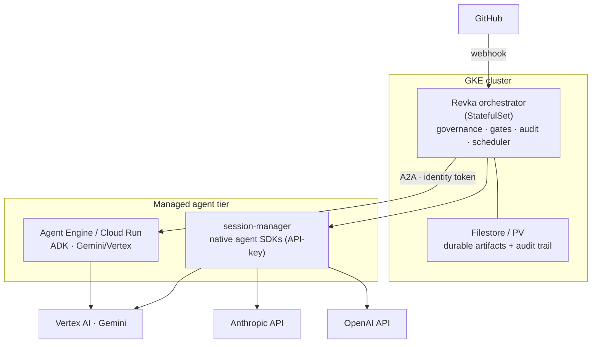
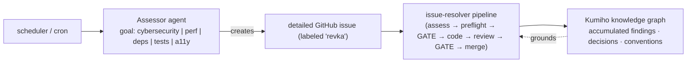

# Revka — Enterprise & Cloud Architecture Roadmap

The Track 3 submission proves the **loop closes**: a GitHub issue is resolved
end-to-end by a governed, multi-agent system on Google Cloud — assess → AgentOps
A2A preflight → human gate → ADK/Gemini coder PR → grounded reviewer → human gate
→ merge → close, with per-agent identity and no API keys. This document is the
roadmap from that demonstrable engine to a sellable enterprise platform.

> Scope note: nothing here is required for the submission. The deployed Cloud
> Run build satisfies all four Track 3 mandates today. This is the evolution.

---

## 1. Runtime: GKE for the stateful core, Cloud Run / Agent Engine for agents

Track 3 permits **Cloud Run or GKE**. Cloud Run is the right zero-ops choice for
the demo; **GKE is the right enterprise target** for three concrete reasons the
demo surfaced:

| Need | Why Cloud Run falls short | GKE answer |
| --- | --- | --- |
| **Durable, auditable artifacts** | Container filesystem is in-memory and per-instance; artifacts vanish on recycle/scale (no mounted volume). | **Filestore (NFS, RWX)** or PersistentVolumes — one durable, shared artifact + audit tree across pods. |
| **Stateful orchestrator** | Scheduler, heartbeat, event listener, and WebSocket session affinity fight a request-scaled, instance-recycling model. | StatefulSet/Deployment with affinity; the orchestrator is genuinely long-lived. |
| **Multi-tenancy** | Limited isolation primitives. | Namespaces, network policies, resource quotas per customer. |

**Recommended topology (hybrid):**

- **GKE** hosts the stateful orchestrator + Filestore-backed durable artifacts.
- **Managed agents** (Agent Engine / Cloud Run via A2A, or the session-manager
  via native SDKs) do the reasoning — scaling independently of the orchestrator.

---

## 2. The agent-auth hard rule: native SDKs + metered API, never consumer subscriptions

The cost arbitrage of driving consumer-subscription CLIs (Claude Pro, ChatGPT
Plus, Antigravity) is fine for a solo developer or internal use, but baking
**personal-tier subscriptions into a commercial product** almost certainly
violates those services' terms (personal-use licenses, not "serve your SaaS").

**Hard rule for the enterprise tier:** every agent runs through a provider's
**agent SDK with metered API / Vertex auth — never a consumer CLI subscription.**

The `session-manager` is the home for this (it already has the provider
abstraction). Use each vendor's *agent* SDK (not the raw completion API — the
agent SDK is the tool-using loop you'd otherwise rebuild):

| Provider | Agent SDK | Auth |
| --- | --- | --- |
| Anthropic | `@anthropic-ai/claude-agent-sdk` (already wired) | `ANTHROPIC_API_KEY` |
| OpenAI | OpenAI Agents SDK / Responses API w/ tools | `OPENAI_API_KEY` |
| Gemini | Google ADK (already used by the cloud agents) | Vertex / ADC |

**Result:** the session-manager becomes a **multi-model agent runtime** — pick
Claude, GPT, or Gemini per workflow step, all key-authed, all headless (no CLI
binaries; runs on Cloud Run *and* GKE), all emitting structured SDK events
instead of stdout scraping.

**Deliberate trade-off:** this removes the subscription cost arbitrage —
everything is metered API spend. That is the cost of legal cleanliness, so it is
offered as a tier:

- **Enterprise tier:** API-key agent SDKs only. Hard rule. Billable, multi-tenant-safe.
- **BYO / cost-sensitive tier:** subscription CLIs allowed, but the *customer*
  supplies the login and accepts the ToS — the liability is theirs.

---

## 3. The product: continuous, goal-driven autonomous improvement

The issue-resolver is one instance of a larger loop. The same engine, scheduled
and goal-parameterized, becomes a **continuous codebase-improvement platform**:

- **Goal-driven** = one engine, many verticals. The only new component is a
  goal-parameterized **assessor agent** (a sibling of the coder/reviewer).
- **Governance is the moat.** Plenty of tools write code; what enterprises can't
  buy is autonomous improvement they're *allowed to turn on* — every change
  gated, attributed to a distinct cryptographic agent identity, and recorded.
  Cybersecurity is a particularly strong wedge: continuous audit → triaged
  findings → governed remediation PRs.
- **Kumiho is the data flywheel.** Every assessment, review, and decision is
  stored and connected, so over time the knowledge graph *becomes* the repo's
  living standards and audit history — grounding future reviews in accumulated
  institutional memory that no competitor can replicate.

**Required guardrails before "continuous" is safe at scale:** per-run scope
limits, blast-radius caps, rollback, and gates that stay meaningful rather than
rubber-stamped. The bones exist (gates, identity, audit); productionizing the
continuous loop is its own milestone.

---

## 4. Hardening backlog (surfaced during the build)

| Item | Issue | Fix |
| --- | --- | --- |
| **Durable artifacts** | Cloud Run artifacts are ephemeral/per-instance. | Filestore/PV on GKE, or a GCS volume / push-to-bucket on Cloud Run. |
| **Admin token rotation** | `REVKA_GATEWAY_ADMIN_TOKEN` is long-lived; rotation needs a redeploy, no instant revocation. | Support a token list (rotate with overlap); document the secret-version rotate flow; consider short-lived tokens. |
| **Admin token entropy** | The gateway accepts any non-empty string as a full-access bearer. | Reject tokens below a minimum length/entropy; warn on weak values. |
| **Deployment-specific workflows in OSS** | Cloud-bound workflows hardcoding deployment URLs must not ship as embedded builtins. | Keep them as deployment-owned Kumiho artifacts; OSS builtins stay generic. |
| **Secrets in repo** | Local trigger scripts holding tokens must never be committed. | gitignored; use env/Secret Manager, never literals. |

---

## 5. Mandate alignment (today vs. enterprise)

| Mandate | Demo (today) | Enterprise |
| --- | --- | --- |
| Cloud-Native Runtime | Cloud Run (orchestrator + agents), keyless CI (WIF) | GKE (stateful core + Filestore) + managed agent tier |
| Gemini / Vertex intelligence | Gemini 2.5 Pro via Vertex ADC, no keys | + multi-model session-manager (Claude/GPT/Gemini), API-key hard rule |
| A2A interoperability | A2A discovery + send_task across 4 services | + assessor agent; cross-org A2A federation |
| B2B multi-agent | Governed issue→PR→merge with human gates | Continuous, goal-driven, auditable improvement platform |
