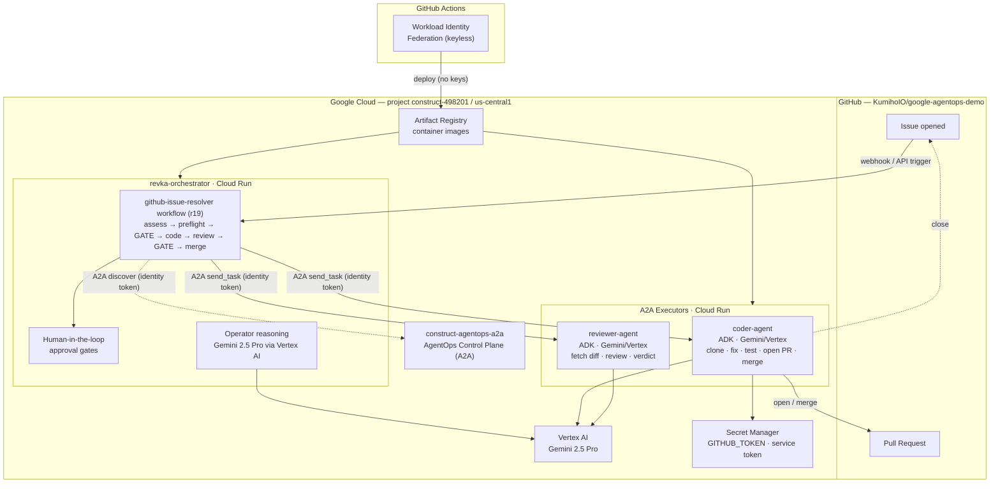
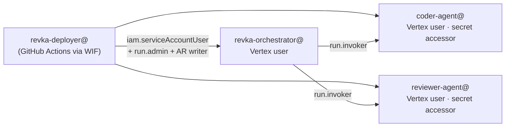

# Revka — Google for Startups AI Agents Challenge, Track 3

**Autonomous, human-governed GitHub issue resolution by a multi-agent system running entirely on Google Cloud.**

A GitHub issue triggers a governed pipeline: a Gemini-powered **assessor** plans
the fix, an **AgentOps preflight** verifies the Google AgentOps / A2A control
plane, and — after a human approval gate — an ADK **coder agent** implements the
fix and opens a PR, an ADK **reviewer agent** reviews it, and after a second gate
the change is merged and the issue closed. Every reasoning step runs on **Gemini
via Vertex AI**; every agent runs on **Cloud Run**; every agent-to-agent hop uses
the **A2A protocol** with per-service cryptographic identity.

---

## Architecture

### Identity & trust mesh (Agent Identity)

Each service has its own Google service account; least-privilege IAM governs
every edge — there are **no long-lived keys** anywhere except a single,
repo-scoped GitHub token held in Secret Manager.

---

## How it maps to the Track 3 mandates

| Mandate | How Revka satisfies it |
| --- | --- |
| **B2B focus** | Autonomous, audited issue→PR→merge resolution with human approval gates — a developer-operations product for engineering orgs. |
| **Cloud-Native Runtime** | Orchestrator and both executor agents run on **Cloud Run** (`revka-orchestrator`, `coder-agent`, `reviewer-agent`), built and deployed via GitHub Actions with **Workload Identity Federation** (no service-account keys). |
| **Google Cloud Powered Intelligence** | Every reasoning step runs on **Gemini 2.5 Pro through Vertex AI**, authenticated by each service's own account via Application Default Credentials — **no API keys**. |
| **A2A Interoperability** | All work steps are **A2A** calls: discovery of the AgentOps control plane, and `send_task`/`get_task` to the coder and reviewer. Cross-service calls authenticate with **Cloud Run identity tokens minted from the metadata server**. |

### Mandatory technologies

- **Intelligence:** Gemini 2.5 Pro on Vertex AI.
- **Orchestration of the work agents:** **Agent Development Kit (ADK)** — the coder and reviewer are ADK agents with function tools (`run_shell`, `read_file`/`write_file`, `github_open_pr`, `github_merge_pr`, `github_comment_and_close_issue`, `github_get_pr_diff`).
- **Higher-order orchestration & governance:** the Revka workflow engine (declarative steps, structured I/O, human gates, audit, checkpoint/resume).
- **Infrastructure:** Cloud Run + Artifact Registry + Secret Manager + Vertex AI + Workload Identity Federation.

---

## The workflow (`github-issue-resolver`, revision r19)

8 steps, no local CLI agents — every reasoning/work step is A2A, Python, or a human gate:

| # | Step | Type | What it does |
| --- | --- | --- | --- |
| 1 | `assess_issue` | python | Parse the GitHub payload; derive issue number/title/body and a fix strategy. |
| 2 | `agentops_preflight` | python | Mint a metadata-server identity token and A2A-discover the AgentOps control plane (evidence, never hard-fails). |
| 3 | `human_approval_gate_1` | human gate | Approve before any repository mutation. |
| 4 | `deploy_coder_agent` | **a2a** | Send the issue+strategy to the ADK coder; it clones, implements, tests, opens a PR. |
| 5 | `extract_pr_number` | python | Regex the PR number out of the coder's `pr_url` for downstream steps. |
| 6 | `review_pr` | **a2a** | Send the PR to the ADK reviewer; it fetches the diff and returns a verdict. |
| 7 | `human_approval_gate_2` | human gate | Approve before merge. |
| 8 | `merge_and_close` | **a2a** | Coder merges the PR and closes the issue via the GitHub REST API. |

---

## Live proof

Multiple complete cloud-only runs, verified on GitHub:

- **Fully automatic trigger:** opening an issue and adding the **`revka`** label
  fires a GitHub Action that POSTs to the Cloud Run orchestrator (stable bearer
  token in repo secrets) — no manual command. Issue → Action → Cloud Run →
  PR → merge → close.
- **Run `89bb9e5a`** (issue [#8](https://github.com/KumihoIO/google-agentops-demo/issues/8) → PR [#9](https://github.com/KumihoIO/google-agentops-demo/pull/9), **MERGED / CLOSED**):
  the **grounded reviewer cited a specific rule** — *"violates Rule 1: 'Money is
  integer cents, never floats'"* — retrieved from the **Vertex AI Search**
  conventions data store.
- **Run `57b1b6b8`** (issue [#6](https://github.com/KumihoIO/google-agentops-demo/issues/6) → PR [#7](https://github.com/KumihoIO/google-agentops-demo/pull/7), **MERGED / CLOSED**)
  and earlier run on issue #3 → PR #4.
- **AgentOps preflight:** `a2a_discovery_status: discovered` against the Cloud
  Run control plane (identity token minted from the metadata server).
- **Reasoning:** Gemini 2.5 Pro via Vertex AI throughout; coder & reviewer are
  ADK agents; grounding via Vertex AI Search.

### Grounding (Vertex AI Search)

The reviewer agent is grounded in the repository's coding conventions
(`reviewer-conventions` Discovery Engine data store). It queries Vertex AI Search
and checks the PR diff against the retrieved numbered rules, citing them in its
findings — a concrete instance of the challenge's grounding/RAG consideration
that makes the multi-agent review more capable than a single agent.

## Service endpoints

| Service | URL |
| --- | --- |
| Orchestrator | `https://revka-orchestrator-n22ujw2j2a-uc.a.run.app` |
| Coder agent | `https://coder-agent-n22ujw2j2a-uc.a.run.app` |
| Reviewer agent | `https://reviewer-agent-n22ujw2j2a-uc.a.run.app` |
| AgentOps control plane | `https://construct-agentops-a2a-1091585228963.us-central1.run.app` |

Access for judges: see [`docs/JUDGES.md`](./JUDGES.md).
Enterprise & GKE roadmap: see [`docs/ENTERPRISE_ROADMAP.md`](./ENTERPRISE_ROADMAP.md).

> Note: the cloud-native `github-issue-resolver` workflow is deployment-specific
> (it A2A-calls this project's Cloud Run agents) and lives as a Kumiho-revisioned
> artifact in this deployment — it is intentionally **not** shipped in the OSS
> builtins.
