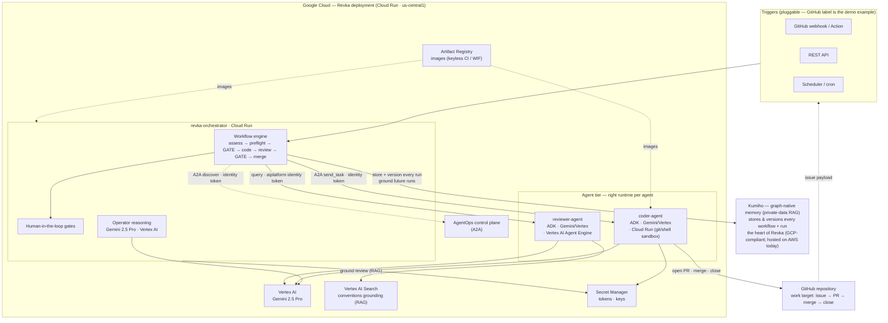
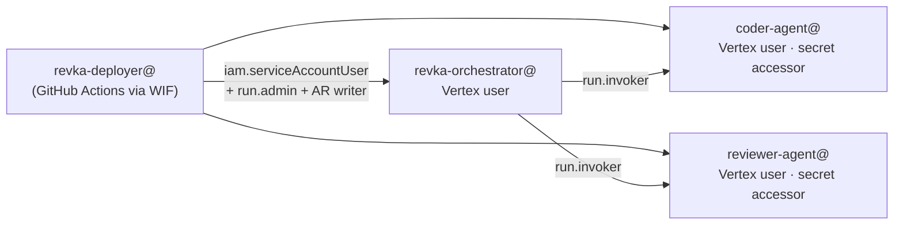

# Revka — Google for Startups AI Agents Challenge, Track 3

**A platform for building autonomous, auditable, multi-agent workflows on Google Cloud — governed by humans, grounded in memory that compounds.**

Revka lets an enterprise define multi-step work *visually*, as a graph of steps;
**ADK agents** execute it, coordinating over the **A2A protocol** and reasoning on
**Gemini via Vertex AI**; a human approves the decisions that matter; and every
run is stored and versioned in **Kumiho**, Revka's graph-native memory. The same
engine runs security audits, compliance reviews, data pipelines, and research —
any process you can define.

This submission demonstrates **one** such workflow end to end —
**`github-issue-resolver`**. A GitHub issue triggers a governed pipeline: a
Gemini **assessor** plans the fix, an **AgentOps preflight** verifies the Google
AgentOps / A2A control plane, and — after a human gate — an ADK **coder agent**
(on Cloud Run, where it has a real git/shell sandbox) implements the fix and
opens a PR; an ADK **reviewer agent** (on **Vertex AI Agent Engine**, grounded in
**Vertex AI Search**) reviews it; and after a second gate the change is merged and
the issue closed. Two grounded specialists, governed by a human, doing what no
single agent could do reliably — and the whole run recorded in Kumiho.

---

## Architecture

The architecture centers on **Revka running on Google Cloud** and its
integration with Google Cloud services. Triggers are pluggable — a GitHub
webhook/Action, the REST API, or the scheduler; the demo uses the GitHub-label
trigger as one example. The GitHub repository is the *work target*, not the core.

### Identity & trust mesh (Agent Identity)

Each service has its own Google service account; least-privilege IAM governs
every edge — there are **no long-lived keys** anywhere except a single,
repo-scoped GitHub token held in Secret Manager.

---

## How Revka addresses the five key considerations

| Key consideration | How Revka delivers it |
| --- | --- |
| **Multi-agent design & orchestration with ADK** | The work is done by **ADK agents** — a coder and a reviewer, each with its own function tools — coordinated by Revka's declarative **workflow engine** over the **A2A protocol**. Orchestration is *visual and governed*: a step graph with structured I/O, human gates, audit, and checkpoint/resume — not a single prompt. |
| **Deployment on Agent Engine** | The **reviewer** — a pure reasoning + grounding agent — is deployed to **Vertex AI Agent Engine** (`reasoning_engines.AdkApp`), the managed runtime built for exactly this. The **coder** stays on **Cloud Run** because it needs a real git/shell sandbox to clone, edit, test, and open PRs. *Right runtime per agent* is the design, not a compromise. |
| **Compelling business use case** | Revka is a **platform** for autonomous, auditable enterprise workflows — security audits, compliance reviews, data pipelines, research, operations. The demoed `github-issue-resolver` is one concrete, high-value instance: autonomous dev-ops with a human in the loop and a full audit trail. |
| **Grounding & RAG** | Two layers. **(1) Vertex AI Search** grounds the reviewer in the repo's coding conventions — it retrieves numbered rules and cites them in findings. **(2) Kumiho**, Revka's **graph-native memory**, is a *private-data RAG*: it stores and versions **every workflow and every run**, so past work grounds future runs. Kumiho is the heart of Revka. |
| **Collaboration + grounding > a single agent** | See the dedicated argument [below](#why-multi-agent--grounding-beats-a-single-agent). In short: a *grounded reviewer* independently catches what the coder — optimizing to satisfy the task — is structurally blind to, and human gates bound the autonomy. The separation of duties **is** the capability. |

## How it maps to the Track 3 mandates

| Mandate | How Revka satisfies it |
| --- | --- |
| **B2B focus** | Autonomous, audited issue→PR→merge resolution with human approval gates — a developer-operations product for engineering orgs. |
| **Cloud-Native Runtime** | The orchestrator and coder run on **Cloud Run** (`revka-orchestrator`, `coder-agent`); the reviewer runs on **Vertex AI Agent Engine** (`revka-reviewer`). All built and deployed via GitHub Actions with **Workload Identity Federation** (no service-account keys). |
| **Google Cloud Powered Intelligence** | Every reasoning step runs on **Gemini 2.5 Pro through Vertex AI**, authenticated by each service's own account via Application Default Credentials — **no API keys**. |
| **A2A Interoperability** | All work steps are **A2A** calls: discovery of the AgentOps control plane, and `send_task`/`get_task` to the coder and reviewer. Cross-service calls authenticate with **Cloud Run identity tokens minted from the metadata server**. |

### Mandatory technologies

- **Intelligence:** Gemini 2.5 Pro on Vertex AI.
- **Orchestration of the work agents:** **Agent Development Kit (ADK)** — the coder and reviewer are ADK agents with function tools (`run_shell`, `read_file`/`write_file`, `github_open_pr`, `github_merge_pr`, `github_comment_and_close_issue`, `github_get_pr_diff`).
- **Higher-order orchestration & governance:** the Revka workflow engine (declarative steps, structured I/O, human gates, audit, checkpoint/resume), with **Kumiho** graph-native memory storing and versioning every run.
- **Agent runtimes:** **Vertex AI Agent Engine** for the reasoning reviewer; **Cloud Run** for the orchestrator and the sandbox-needing coder.
- **Infrastructure:** Cloud Run + Vertex AI Agent Engine + Artifact Registry + Secret Manager + Vertex AI + Vertex AI Search + Workload Identity Federation.

---

## The workflow (`github-issue-resolver`, revision r19)

8 steps, no local CLI agents — every reasoning/work step is A2A, Python, or a human gate:

| # | Step | Type | What it does |
| --- | --- | --- | --- |
| 1 | `assess_issue` | python | Parse the GitHub payload; derive issue number/title/body and a fix strategy. |
| 2 | `agentops_preflight` | python | Mint a metadata-server identity token and A2A-discover the AgentOps control plane (evidence, never hard-fails). |
| 3 | `human_approval_gate_1` | human gate | Approve before any repository mutation. |
| 4 | `deploy_coder_agent` | **a2a** | Send the issue+strategy to the ADK coder; it clones, implements, tests, opens a PR. |
| 5 | `extract_pr_number` | python | Regex the PR number out of the coder's `pr_url` for downstream steps. |
| 6 | `review_pr` | **agent_engine** | Query the ADK reviewer on **Vertex AI Agent Engine** (orchestrator mints an `aiplatform.user` identity token); it fetches the diff, grounds in Vertex AI Search, and returns a verdict. |
| 7 | `human_approval_gate_2` | human gate | Approve before merge. |
| 8 | `merge_and_close` | **a2a** | Coder merges the PR and closes the issue via the GitHub REST API. |

---

## Live proof

Multiple complete cloud-only runs, verified on GitHub:

- **Fully automatic trigger:** opening an issue and adding the **`revka`** label
  fires a GitHub Action that POSTs to the Cloud Run orchestrator (stable bearer
  token in repo secrets) — no manual command. Issue → Action → Cloud Run →
  PR → merge → close.
- **Run `89bb9e5a`** (issue [#8](https://github.com/KumihoIO/google-agentops-demo/issues/8) → PR [#9](https://github.com/KumihoIO/google-agentops-demo/pull/9), **MERGED / CLOSED**):
  the **grounded reviewer cited a specific rule** — *"violates Rule 1: 'Money is
  integer cents, never floats'"* — retrieved from the **Vertex AI Search**
  conventions data store.
- **Run `57b1b6b8`** (issue [#6](https://github.com/KumihoIO/google-agentops-demo/issues/6) → PR [#7](https://github.com/KumihoIO/google-agentops-demo/pull/7), **MERGED / CLOSED**)
  and earlier run on issue #3 → PR #4.
- **AgentOps preflight:** `a2a_discovery_status: discovered` against the Cloud
  Run control plane (identity token minted from the metadata server).
- **Reasoning:** Gemini 2.5 Pro via Vertex AI throughout; coder & reviewer are
  ADK agents; grounding via Vertex AI Search.

### Grounding & RAG — two layers

**1. Vertex AI Search (per-agent grounding).** The reviewer agent is grounded in
the repository's coding conventions (`reviewer-conventions` Discovery Engine data
store). It queries Vertex AI Search and checks the PR diff against the retrieved
numbered rules, citing them in its findings (e.g. *"violates Rule 1: money is
integer cents, never floats"*).

**2. Kumiho — graph-native memory as private-data RAG.** Kumiho is the heart of
Revka. Every workflow definition and every run — inputs, each step's structured
output, agent verdicts, approvals, the final result — is **stored and versioned**
as a connected graph, not flat logs. This is a *custom RAG over the organization's
own private data*: past runs become retrievable, attributable context that grounds
future runs, and the version history is the audit trail. Workflow revisions
(e.g. `github-issue-resolver` r19) are themselves Kumiho-tracked artifacts.
Kumiho is GCP-compliant (previously GCP-hosted; on AWS today), and a managed-GCP
migration is on the roadmap.

### Why multi-agent + grounding beats a single agent

A single agent asked to "fix the issue and self-review" is structurally
conflicted: the same context and objective that produce the change also produce
the self-assessment, so it is blind to its own blind spots. Revka splits the work
into **independent, separately-grounded specialists**:

- The **coder** (Cloud Run sandbox) optimizes to *satisfy the task* — clone,
  implement, test, open a PR.
- The **reviewer** (Agent Engine) optimizes to *find what's wrong*, grounded in
  named, retrieved standards it did not write and the coder never saw as a rubric.
- **Human gates** bound the autonomy at the two decisions that carry risk
  (first mutation, and merge), and **Kumiho** records every step so the outcome is
  auditable and feeds the next run.

The separation of duties — plus grounding that gives the reviewer an external
source of truth — is precisely what makes the result trustworthy. That is the
capability a single agent cannot reach: not more tokens, but **independent
verification against grounded standards, under human governance**.

## Service endpoints

| Service | URL |
| --- | --- |
| Orchestrator | Cloud Run · `https://revka-orchestrator-n22ujw2j2a-uc.a.run.app` |
| Coder agent | Cloud Run · `https://coder-agent-n22ujw2j2a-uc.a.run.app` |
| Reviewer agent | **Vertex AI Agent Engine** · `projects/1091585228963/locations/us-central1/reasoningEngines/3625053003137941504` |
| AgentOps control plane | Cloud Run · `https://construct-agentops-a2a-1091585228963.us-central1.run.app` |

Access for judges: see [`docs/JUDGES.md`](./JUDGES.md).
Enterprise & GKE roadmap: see [`docs/ENTERPRISE_ROADMAP.md`](./ENTERPRISE_ROADMAP.md).

> Note: the cloud-native `github-issue-resolver` workflow is deployment-specific
> (it A2A-calls this project's Cloud Run agents) and lives as a Kumiho-revisioned
> artifact in this deployment — it is intentionally **not** shipped in the OSS
> builtins.
